# FYNE

> 把學習過程中做出的layout記錄下來方便查詢

## 01_first_ cry

## 02_Canvas

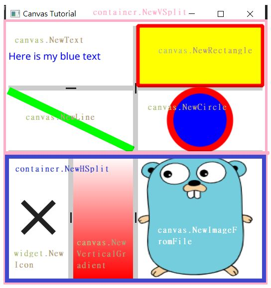

## 03_traffic_lights

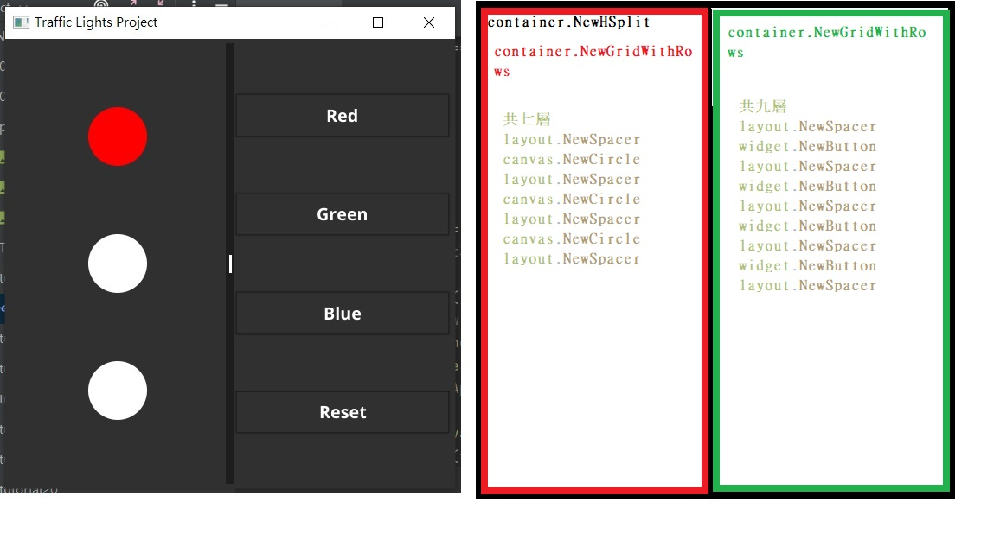

## 04_label

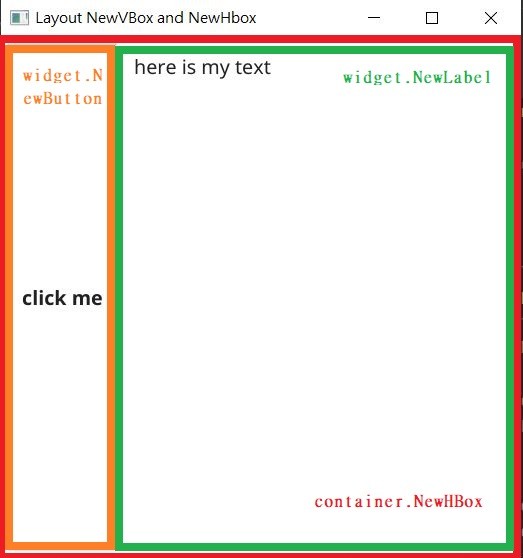

## 05_random_number

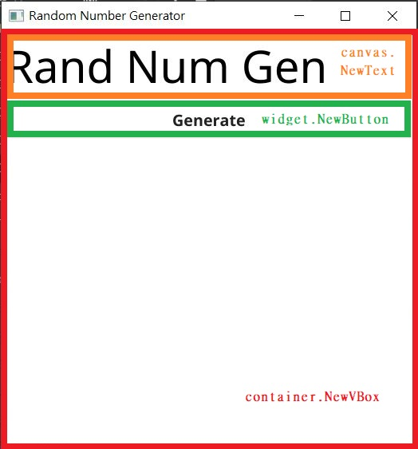

## 06_dice

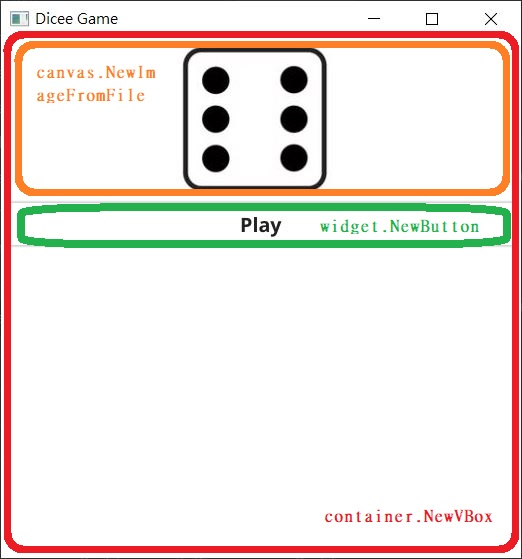

## 07_card

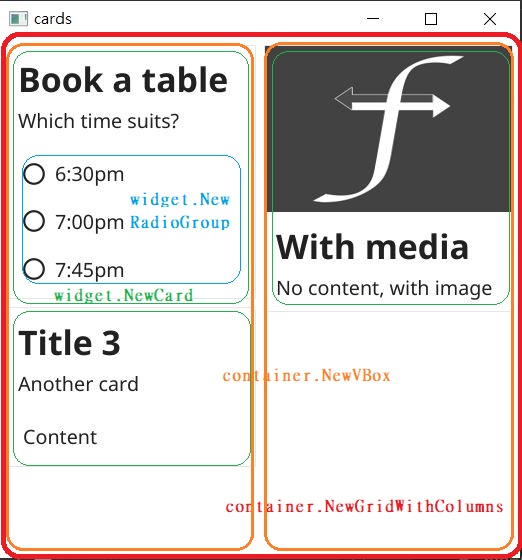

## 08_get_ip

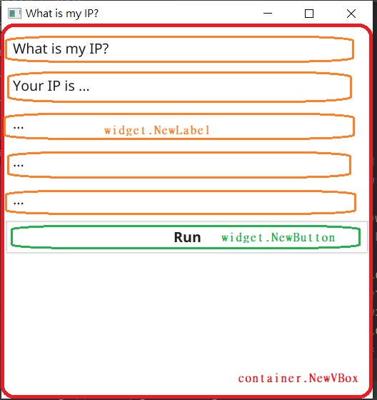

## 09_get_weather

## 10_button

## 11_random_color

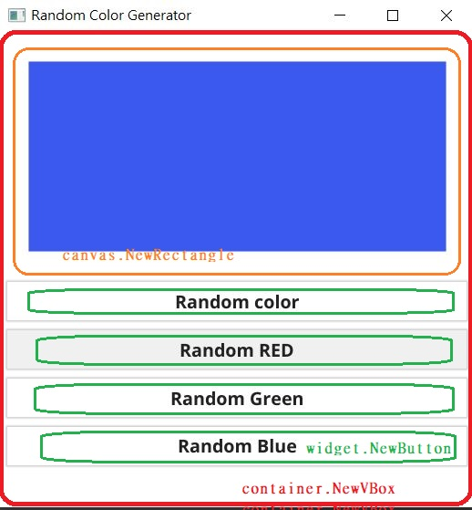

## 12_set_icon

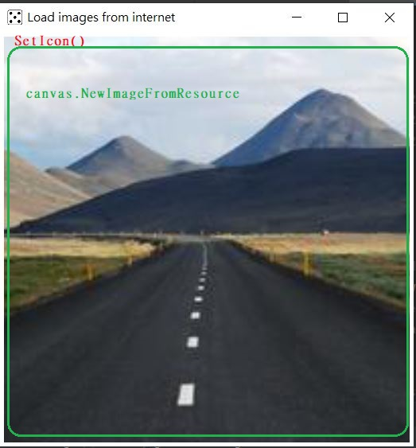

## 13_password

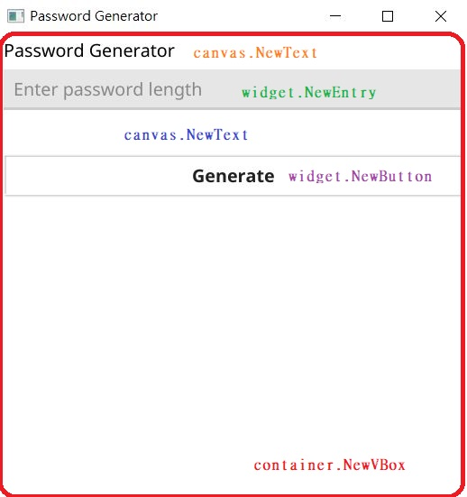

## 14_calc

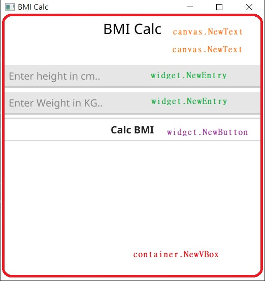

## 15_menu

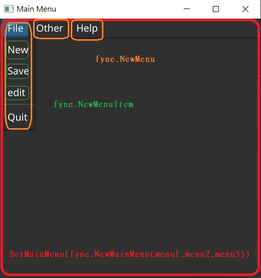

## 16_child_menu

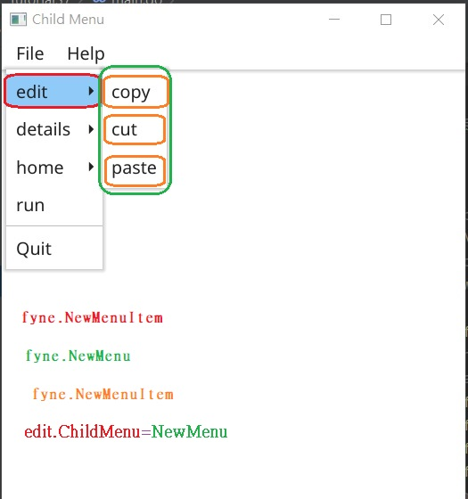

## 17_multi_line

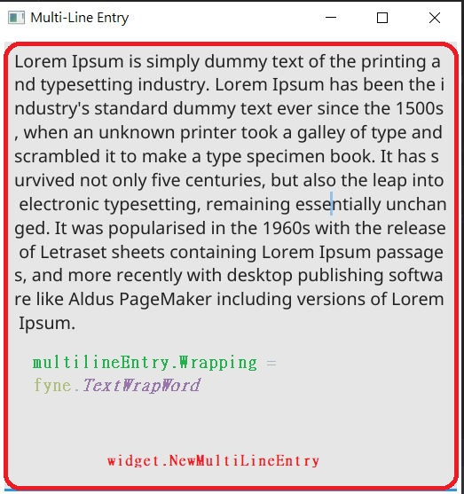

## 18_calculator

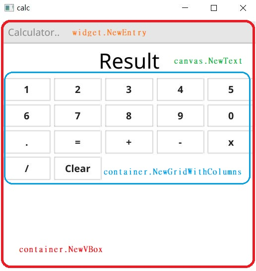

## 19_accordion

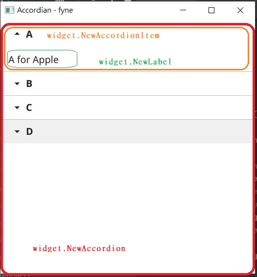

## 20_data_binding

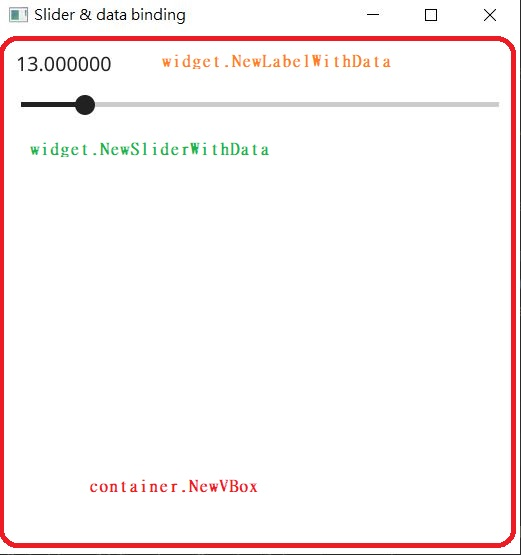

## 21_scroll

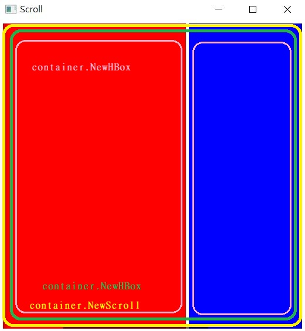

## 22_color_button

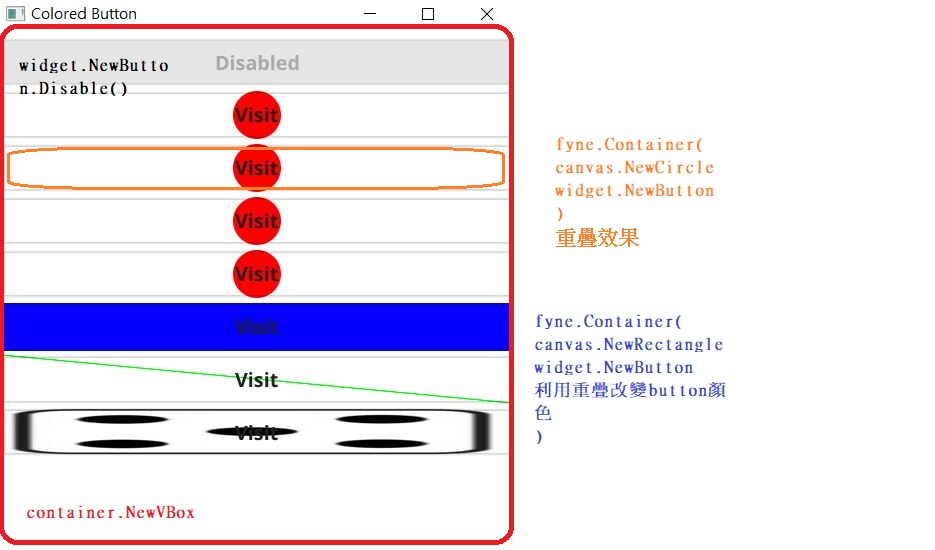

## 23_open_file

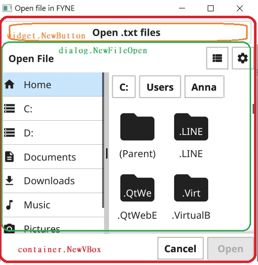

## 24_save_file

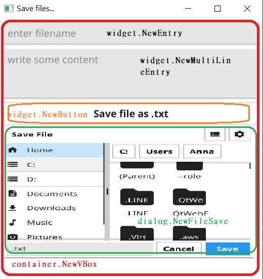

## 25_open_image

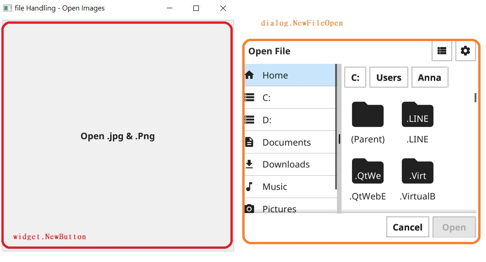

## 26_resize_widget

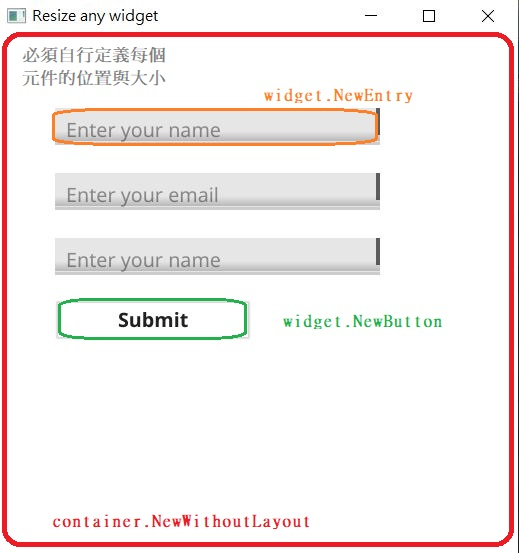

## 27_checkbox

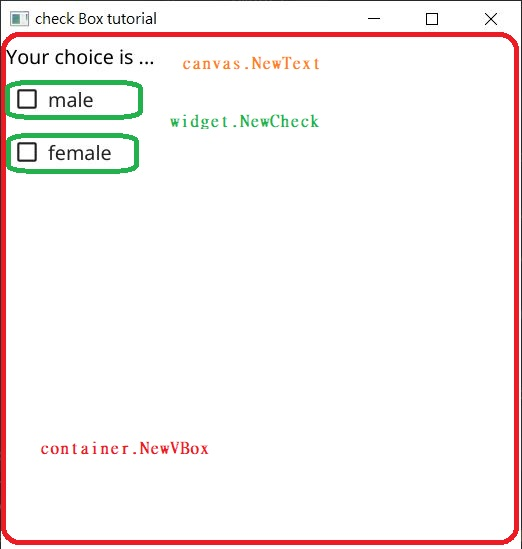

## 28_form

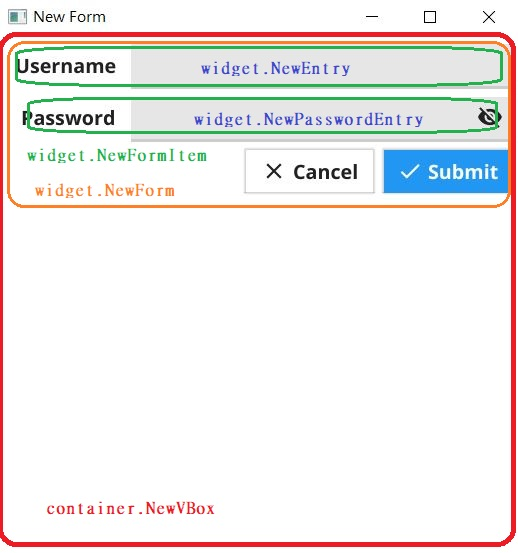

## 29_list

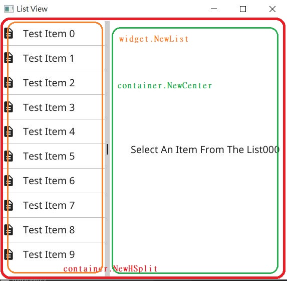

## 30_record_list

## 31_table

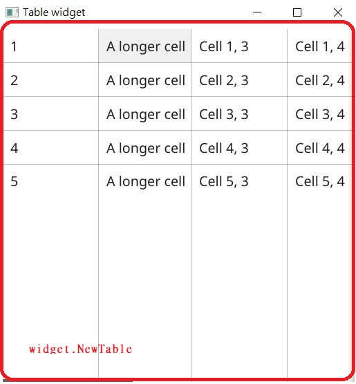

## 32_tool_bar

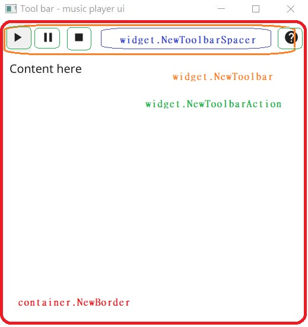

## 33_audio_player

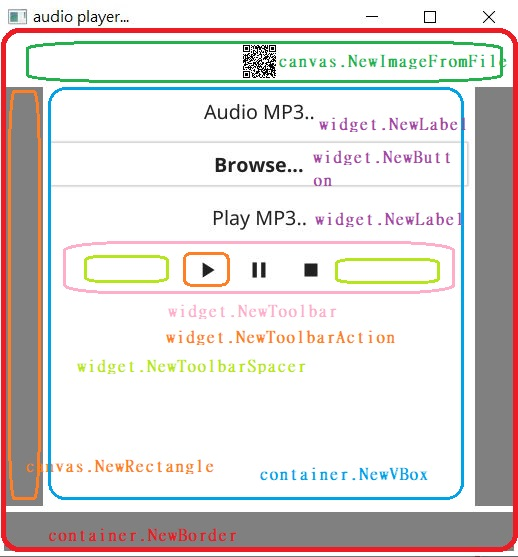

## 34_select_entry

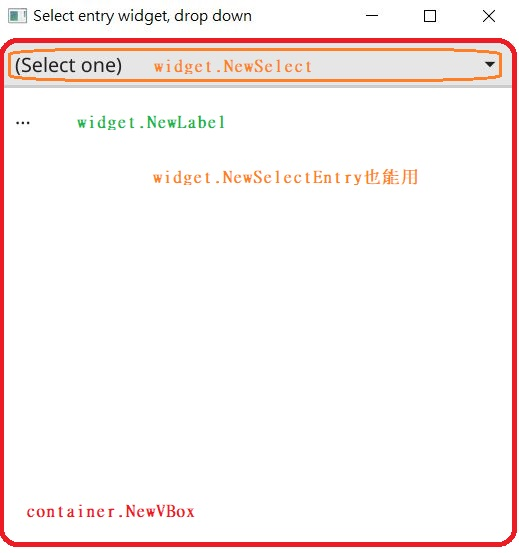

## 35_new_app

## 36_note_pad

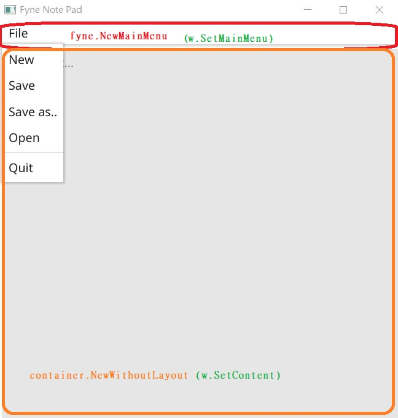

## 37_file_choose_and_select_entry

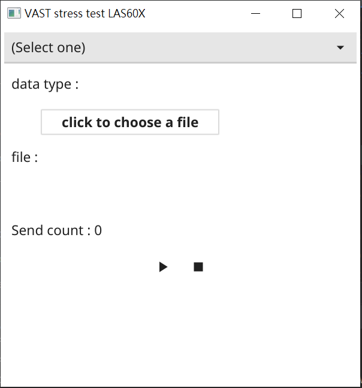

