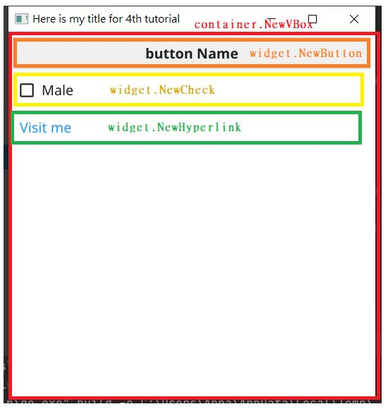
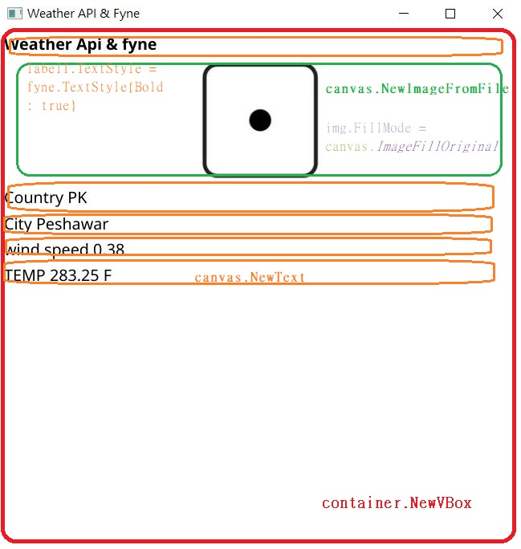
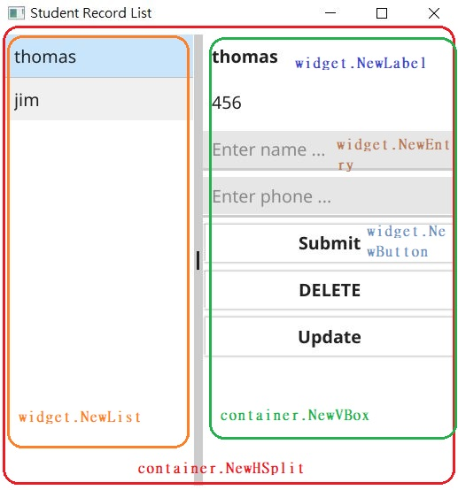

# FYNE

> 把學習過程中做出的layout記錄下來方便查詢

## 01_first_ cry

## 02_Canvas

## 03_traffic_lights

## 04_label

## 05_random_number

## 06_dice

## 07_card

## 08_get_ip

## 09_get_weather

## 10_button

## 11_random_color

## 12_set_icon

## 13_password

## 14_calc

## 15_menu

## 16_child_menu

## 17_multi_line

## 18_calculator

## 19_accordion

## 20_data_binding

## 21_scroll

## 22_color_button

## 23_open_file

## 24_save_file

## 25_open_image

## 26_resize_widget

## 27_checkbox

## 28_form

## 29_list

## 30_record_list

## 31_table

## 32_tool_bar

## 33_audio_player

## 34_select_entry

## 35_new_app

## 36_note_pad

## 37_file_choose_and_select_entry

